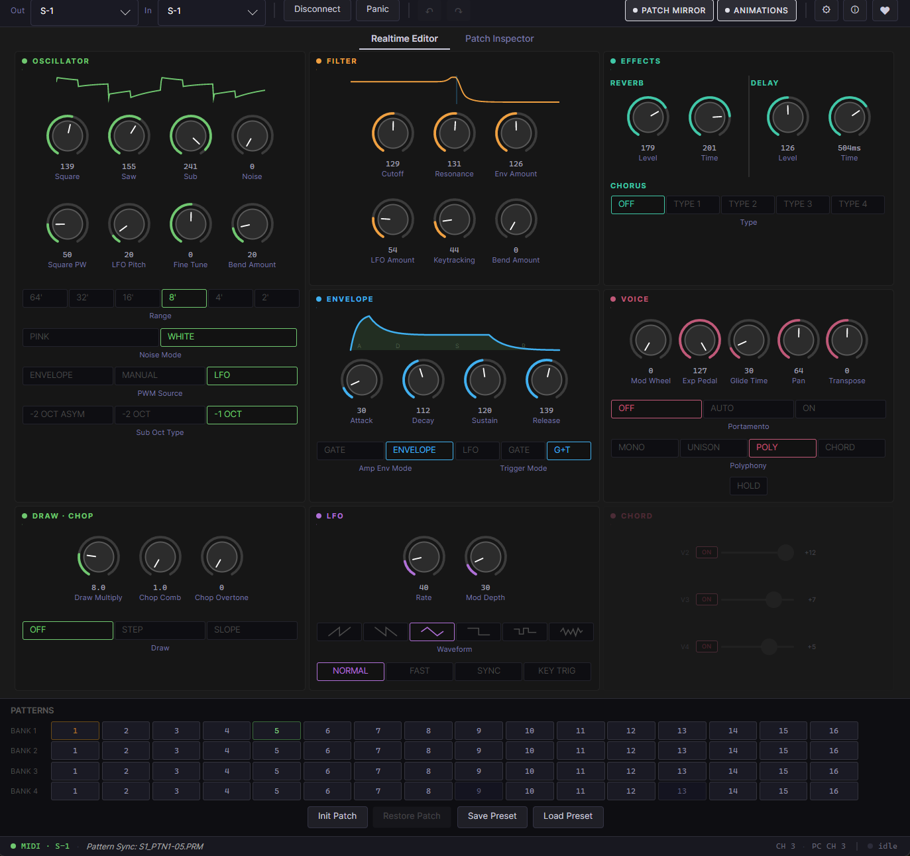
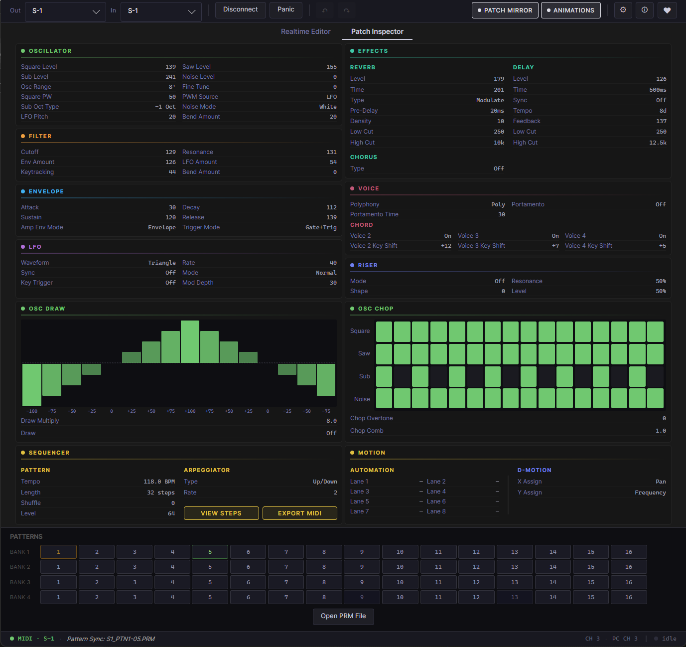

# S1Utility

A desktop companion app for the Roland AIRA Compact S-1 Tweak Synthesizer.

S1Utility connects to a S-1 over MIDI and provides a visual parameter editor, a read-only Patch Inspector for browsing `.PRM` patch backups, and hardware-calibrated heuristic visualizations of the synth's ADSR envelope, filter response and oscillator waveform.

The design principle: **While using heuristics, the app tries to stay honest about what it knows.** When the app can reflect the synth's exact state, it does. When it can't, it surfaces uncertainty rather than displaying wrong or misleading values.

---

## Disclaimer

This is an unofficial third-party tool. This project is not affiliated with, endorsed by, or sponsored by Roland Corporation. Major part of the code is generated with Claude Code, but the app is a product of continuous iteration and refinement.

S1Utility is provided "as is", without warranty of any kind. The author is not responsible for any malfunction, data loss, or damage to your hardware that may result from using this software. That said, the app only sends and receives standard MIDI Control Change (CC) messages — the same messages the S-1 already accepts from any MIDI controller or DAW — and does not write `.PRM` files or use sysex. Practically, the risk of the app harming the device is very low, but you use it at your own risk.

---

## Features

- **Visual parameter editor**. Knobs, LEDs, sliders, and waveform displays that mirror the S-1's current state over MIDI CC.
- **Patch Mirror**. When a `.PRM` folder is configured, the editor stays in sync with the S-1 in real time: it loads the corresponding patch when patterns change on the device and preserves unsaved edits per slot.
- **Sync-state tracking**. Every parameter shows whether the editor has confirmed its value from the synth (via incoming CC, Send All, or PRM load). Unsynced controls go grey with a `?` label.
- **Parameter visualization**. Filter frequency-response curve, animated ADSR envelope visualizer, draw-wave bars with signed value labels, chop pattern grid.
- **Patch Inspector**. Read-only view of all `.PRM` file data, including parameters that have no MIDI CC equivalent and can be only set from the hardware (sequencer data, draw and chop patterns, etc.).
- **Undo / Redo** for parameter edits, with per-CC coalescing for knob drags.
- **Hardware-verified encodings**. CC mappings, ADSR timing constants, oscillater waveforms, and other measured values were established by testing against real hardware.
- **MIDI Export**. One-click export of the pattern sequencer data into a MIDI file.
- **Keyboard shortcuts**. `Ctrl+M` toggle Connect/Disconnect, `Ctrl+I` Init Patch, `Ctrl+R` Restore Patch, `Ctrl+S` Save Preset, `Ctrl+Z`/`Ctrl+Y` Undo/Redo, `Tab` cycle tabs, arrow keys for patch grid navigation.

---

## Screenshots

**Realtime Editor**



**Patch Inspector**



---

## Requirements

- Windows 10 or 11
- .NET 10 SDK (pinned via `global.json`)
- A Roland S-1 connected over USB MIDI

---

## Build and run

```sh
git clone https://github.com/denzlobin/S1Utility.git
cd S1Utility
dotnet build
dotnet run --project S1Utility/S1Utility.csproj
```

Run the tests:

```sh
dotnet test
```

---

## Project status

Release candidate; Targets Windows for now, portability to macOS/Linux is possible in near future (the underlying MIDI library, [DryWetMidi.Multimedia](https://github.com/melanchall/drywetmidi), is cross-platform from v7+; the Win32-specific window aspect-ratio policy would need a sibling implementation).

---

## What will not happen

- **VST, AU, CLAP and other plugin versions.** S-1 Utility is designed as a standalone app, and many of its feature will be difficult or confusing in a plugin version. You are free to reuse any code or design decisions if you want to build a plugin version yourself.
- **iOS, iPadOS, Android versions.** For the same reasons.
- **`.PRM` data editing.** The actual usecase is very questionable, and you probably don't want to test what happens with the device if you feed it with corrupted data.
- **More realtime controls.** Everything controllable by CC is already available on the Realtime Editor tab. Unless the device receives a firmware update with more Control Change parameters, the editor expansion is out of the question.

---

## Known limitations

- **Windows-only** at the moment. The aspect-ratio policy uses Win32 APIs (`WM_SIZING`, `WS_MAXIMIZEBOX`); contributing a sibling implementation for Mac/Linux behind the existing `IWindowSizePolicy` interface would unlock cross-platform builds.
- **Tab 2 (Patch Inspector) is read-only.** The app does not write `.PRM` files — most PRM-only parameters have no MIDI CC path, and writing risks corrupting your patch backups.
- **No sysex.** The S-1 does not use sysex for parameter control.
- **Reliance on up-to-date manual backup.** The app cannot detect if the `.PRM` data on the synth diverged from what is stored on the user's machine. Every time you write into a patch/pattern slot on the hardware, you need to manually copy modified files to the `.PRM` folder on your machine.

---

## How `.PRM` backup works

The S-1 can export its 64-pattern bank as a folder of `.PRM` files via its USB Disk Mode. To activate it power on the device while holding down the Play button. The drive will take 1-2 minutes to get ready. The keyboard pads indicate the loading progress. Once loaded, copy the contents of the BACKUP folder to your computer and configure the path to it in Settings.


---

## Acknowledgments

- [Avalonia](https://avaloniaui.net/) for the cross-platform UI framework.
- [Melanchall.DryWetMidi](https://github.com/melanchall/drywetmidi) for MIDI I/O.

---

## License

This project is licensed under the GNU General Public License v3.0 or later. See [LICENSE](LICENSE) for the full text.

---

## Contributing

See [CONTRIBUTING.md](CONTRIBUTING.md). Hardware-verified values must not be changed without re-verifying against a real S-1; that section is mandatory reading before touching parameter mappings.

[](https://ko-fi.com/M4M5KXQ5P)
